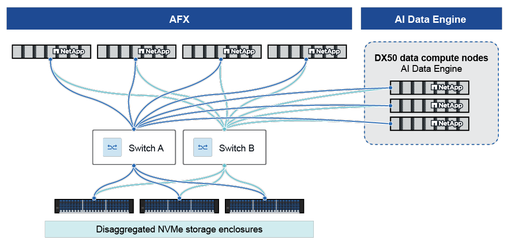

= AI Data Engine 架构
:allow-uri-read: 
:icons: font
:imagesdir: ../media/

[role="lead"]
AIDE 基于可扩展的容错架构构建，将存储和计算分离，为 AI 工作负载提供高性能和灵活性。

== 物理组件

=== AFX 控制器节点

AFX 控制器节点运行专为支持 AFX 环境要求而设计的 ONTAP 软件的专用个性。客户端通过多种协议访问节点，包括 NFS 和 SMB。每个节点都有存储的完整视图，可以根据客户端请求访问存储。节点具有非易失性内存的状态，以保留关键状态信息，并包括特定于目标工作负载的其他增强功能。

AIDE 部署至少需要四个 AFX 控制器节点，以确保高可用性和高性能。

=== 数据计算节点

数据计算节点 (DCN) 是基于 Linux 的服务器，具有高 CPU、RAM 和 GPU 资源，专门用于 AI 数据处理任务。它们托管特定于 AI 的服务，如元数据编目、矢量搜索和嵌入管道。

AIDE 部署需要恰好 _三个_ DCN。

=== 集群/存储交换机

冗余的高速（100GbE 或更高）交换机连接 ONTAP 和 DCN，实现低延迟数据传输和高可用性。

=== 存储架

配备高密度 SSD 的 NVMe-oF 盘架可提供超低延迟和冗余，支持 PB 级存储。

== 网络连接

所有 DCN 和 ONTAP 存储节点均通过冗余高速群集交换机（最低 100GbE）连接。该架构将计算和存储资源分开，允许每个资源独立扩展，并优化性能和资源利用率。

DCN 和 ONTAP 节点之间的网络使用集群交换机上的专用 VLAN 和 IPspaces 进行隔离。这可确保所有通信（如数据访问、管理 API 和内部服务流量）保持安全、高效，并且不会干扰其他网络操作。

== AI Data Engine 主要功能

AI Data Engine (AIDE) 的主要功能协同工作，以实现 AI 数据生命周期的自动化、安全和加速。每个功能都实现为一组在 DCN 上运行的微服务，与 ONTAP 存储集成，并通过 REST API 和管理接口公开。

=== Metadata Engine

Metadata Engine 会自动生成 NetApp 数据资源的结构化、最新的交互式视图。

.许可和访问
Metadata Engine 包含在基本 ONTAP One 许可证中，可在 AIDE 安装时使用。

您可以通过 ONTAP System Manager 访问它。

.功能
* 编录所有数据源的元数据，包括本地存储在 AFX 集群上的卷和从远程 ONTAP 集群同步的卷。
* 自动提取元数据，并在导入或更改数据时填充目录。
* 提供用于查询元数据的 REST API 访问，允许数据从业人员和存储管理员发现、分类和理解数据。
* 从数据路径卸载元数据查询，从而减少存储系统上的 NFS 流量负载。
* 支持具有索引和搜索功能的大型元数据记录。
* 与工作区和数据收集抽象集成，以实施访问控制和治理。

=== 数据同步

Data Sync 是一种自动后台服务，可确保元数据目录和数据集保持最新并与基础数据源保持一致，即使在源数据发生变化时也是如此。

.许可和访问
数据同步功能包含在基本 ONTAP One 许可证中，可在 AIDE 安装后使用。

.功能
* 使用策略驱动的 SnapMirror 复制同步来自远程或本地 ONTAP 集群的数据。来自远程集群的数据被复制到本地 AFX 集群以进行 AIDE 处理。
* 基于检测到的更改进行增量更新，仅传播已修改的数据。
* 提供安全的增量数据移动和跨数据资产的同步。
* 使用每个工作区可配置的刷新率来安排和监控同步间隔。
* 与工作区创建工作流集成，以便在添加新数据源时提取和更新元数据。

=== Data Guardrails

Data Guardrails 服务在整个 AI 生命周期中为敏感数据提供持续、自动化的治理和保护。

.许可和访问
基本 ONTAP One 许可证不包含 Data Guardrails 功能，需要单独的 AIDE 许可证。

您可以通过 AI Data Engine Console 访问护栏功能。

.功能
* 持续扫描、分类和归类数据。
* 使用用于 PII 检测等任务的内置和可自定义分类器来识别敏感数据和风险。
* 通过策略驱动的编辑、屏蔽和访问限制，自动处理敏感数据。
* 通过附加到工作空间的 Data Guardrails 策略执行公司和监管标准。
* 通过审核日志记录和合规性报告，限制对配置的敏感文件或卷的访问。
* 与工作空间和数据收集管理集成，在 AI 数据工作流程中一致地应用护栏。

=== Data Curator

Data Curator 服务可实现 AI 和 GenAI 应用程序的快速数据发现、搜索、矢量化和检索。

.许可和访问
基本 ONTAP One 许可证不包含 Data Curator 功能，需要单独的 AIDE 许可证。

您可以通过 AI Data Engine Console 访问 Data Curator。

.功能
* 使用集中式元数据目录搜索存储中的相关数据。
* 为数据科学家提供工具，以创建精心策划的数据集。
* 在存储层自动生成矢量嵌入。
* 为 AI 应用程序提供安全的检索端点，支持矢量语义搜索和重新排名。
* 与 AI 工具和技术集成，包括 Retrieval-Augmented Generation (RAG) 管道和代理 AI 框架。
* 提供 REST API，用于以编程方式访问数据集、矢量搜索和检索端点。

== 安全与多租户

该平台同时实施基于角色的访问控制 (RBAC) 和资源级别的访问控制列表 (ACL)。审核所有 API 和用户操作，并在静态和传输过程中对所有数据进行加密。针对数据和元数据对单个租户进行隔离。

.相关信息
* link:../install-setup/install-license-task.html["安装 AIDE 许可证"]
* link:../vectorization/zero-to-rag.html["Data-to-RAG 快速启动"]

